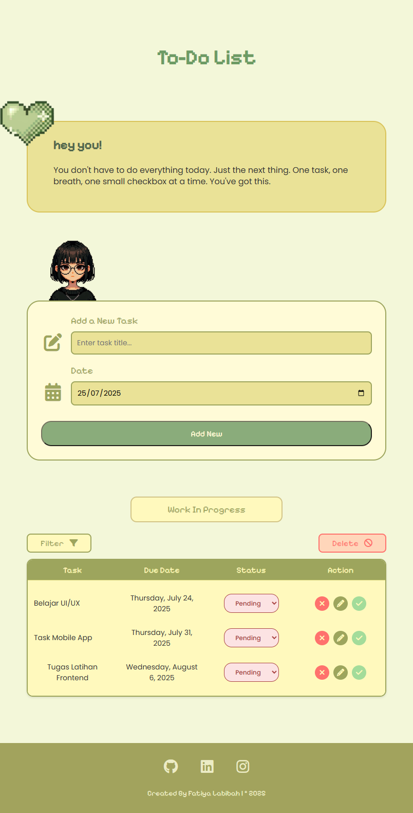

# 📝 To-Do List App | Proyek Coding Camp RevoU

Aplikasi web **To-Do List** sederhana namun fungsional yang dibuat sebagai mini-project untuk **Coding Camp RevoU**. Aplikasi ini dirancang untuk membantu pengguna mengelola tugas harian dengan antarmuka yang bersih dan intuitif. Dibangun sepenuhnya menggunakan **HTML, CSS, dan JavaScript murni** (Vanilla JS) untuk mempraktikkan dasar-dasar pengembangan web front-end.

---
## ✨ Fitur Utama

-   ✅ **Manajemen Tugas (CRUD):** Tambah, lihat, edit, dan hapus tugas dengan mudah.
-   ✏️ **Update Tugas:** Popup modal interaktif untuk mengubah detail tugas.
-   📊 **Ubah Status:** Lacak progres setiap tugas dengan status **Pending, Ongoing,** dan **Done**.
-   🔍 **Filter Tugas:** Saring daftar tugas berdasarkan status untuk fokus pada apa yang penting.
-   💾 **Penyimpanan Lokal:** Semua tugas tersimpan di **Local Storage**, sehingga data tidak akan hilang saat browser ditutup atau di-refresh.
-   📱 **Desain Responsif:** Tampilan yang dioptimalkan untuk pengalaman pengguna yang baik di perangkat desktop, tablet, dan mobile.
-   🔔 **Notifikasi & Konfirmasi:** Popup konfirmasi untuk aksi penting (seperti hapus dan tandai selesai) dan notifikasi untuk feedback kepada pengguna.

---
## 🛠️ Teknologi yang Digunakan

-   **Struktur & Konten**: HTML5
-   **Styling**: CSS3 (termasuk Flexbox & Grid untuk layout)
-   **Fungsionalitas**: JavaScript (ES6+) untuk manipulasi DOM dan logika aplikasi.
-   **Penyimpanan Data**: Web Storage API (Local Storage)
-   **Ikon**: Font Awesome
-   **Font**: Google Fonts (Poppins & Pixelify Sans)
-   **Library Tambahan**: Choices.js (untuk dropdown kustom)

---
## 📂 Struktur Folder Proyek

```bash
.
├── assets/
│   ├── favicon.png
│   ├── kartun.png
│   └── love.png
├── css/
│   └── style.css
├── js/
│   └── script.js
├── screenshots/
│   ├── home-view.png
│   ├── edit-modal.png
│   └── delete-confirmation.png
└── index.html
```

## 📸 Tampilan Aplikasi
Menampilkan antarmuka daftar tugas yang sederhana dan responsif — pengguna dapat menambahkan, mengedit, memfilter berdasarkan status (aktif/selesai), serta menghapus tugas.


## 🧪 Status Pengembangan
| Fitur               | Status | Keterangan                                                  |
|---------------------|--------|-------------------------------------------------------------|
| 🔍 Filter           | ✅    | Sudah berjalan real-time berbasis keyword                   |
| ✏️ Edit Tugas       | ✅    | Edit teks dan tanggal tugas                                 |
| ➕ Tambah Tugas     | ✅    | Upload + preview + menyimpan ke database secara realtime    |
| 🛡️ Validasi Form    | ✅    | Validasi dasar tersedia, namun belum semua bersifat wajib   |

## 👩‍💻 Tentang Pengembang

Proyek ini dikembangkan untuk memenuhi Ujian Akhir Semester (UAS) mata kuliah **Pemrograman Frontend**.

**Pengembang**:  
🧑‍💻 *Fatiya Labibah*  
🎓  *Coding Camp RevoU - 21 Jul 25*  
